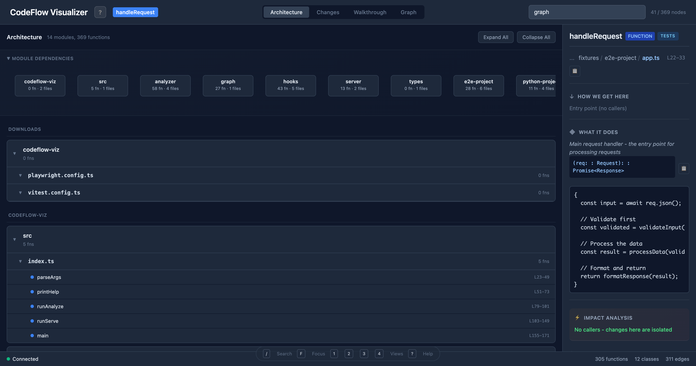
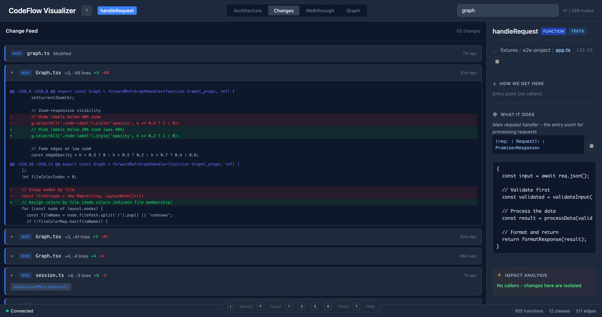
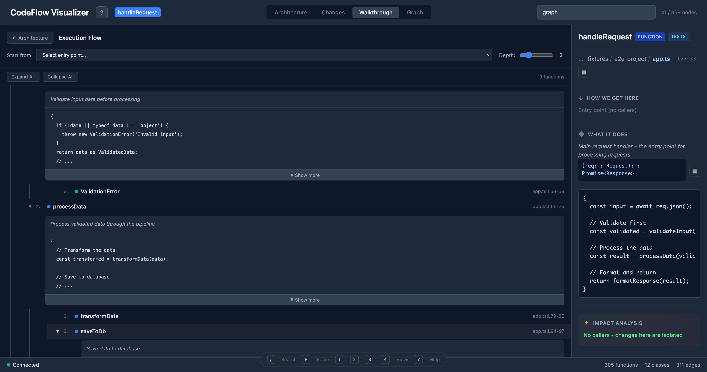
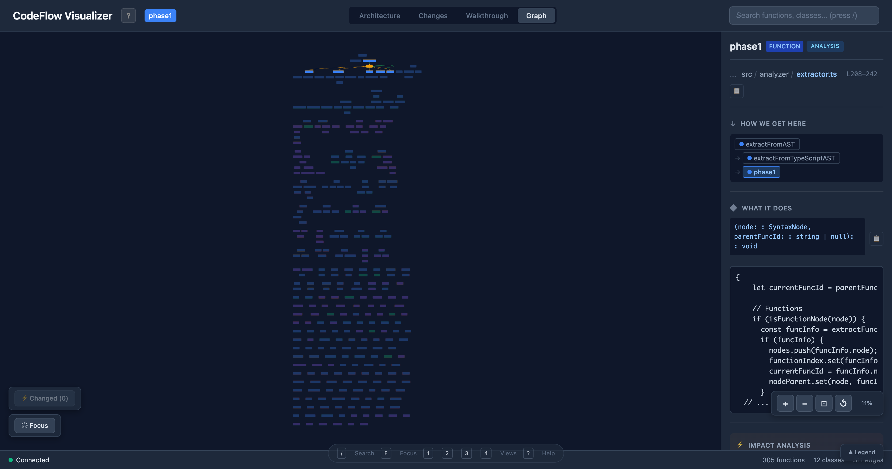

# CodeFlow Visualizer

Real-time code visualization for understanding how your codebase connects. See call graphs, trace execution flow, and watch changes as they happen.

## Visual Tour

### 1. Architecture View
*Get the big picture of your codebase*



The Architecture view shows module dependencies as an interactive diagram. The left panel displays a file tree organized by module, letting you expand any file to see its functions. Click a function to see its details in the right panel including source preview, callers, and callees.

### 2. Changes View
*Track modifications in real-time*



The Changes view provides a live feed of file modifications with git-style diffs. Each change shows the file name, line counts (+added/-removed), timestamp, and which functions were affected. Click any entry to expand the full diff with syntax highlighting. The badges indicate NEW files vs MODified files.

### 3. Walkthrough View
*Step through execution flow*



The Walkthrough view displays the call tree from any entry point. Starting from `handleRequest`, you can see the complete execution flow: it calls `validateInput` (which may throw `ValidationError`), then `processData` (which calls `transformData` and `saveToDb`), and finally `formatResponse`. Each step shows the function signature and a preview of what it does.

### 4. Graph View
*Visualize the complete call graph*



The Graph view renders all 300+ functions as an interactive node graph. Nodes are color-coded by file, and edges show call relationships. Click any node to see its details: where it lives in the codebase, how callers reach it (the call chain), what it does (signature + code preview), impact analysis (how many functions are affected by changes), and what functions it calls.

---

## Quick Start

```bash
# Clone and install
git clone https://github.com/kylenewm/code-visualizer.git
cd code-visualizer
npm install    # installs both backend and frontend

# Start (analyzes current directory)
npm run dev

# Or analyze a different project
npm run dev /path/to/your/project
```

Open http://localhost:5173 in your browser.

## Try It Out

The repo includes test fixtures you can explore:

```bash
# Analyze the test fixtures
npm run dev test/fixtures/e2e-project

# Or analyze CodeFlow itself
npm run dev .
```

## Features

| View | Purpose |
|------|---------|
| **Architecture** | Module-level overview, drill into files/functions |
| **Changes** | Live feed of modifications with git diffs |
| **Walkthrough** | Step through execution flow from any entry point |
| **Graph** | Interactive call graph with 300+ node support |

**Keyboard shortcuts:** `/` search, `1-4` switch views, `F` focus mode, `?` help

## Supported Languages

- TypeScript / JavaScript
- Python

## How It Works

1. **Parser** - tree-sitter extracts AST from source files
2. **Extractor** - identifies functions, classes, imports, call sites
3. **Graph Engine** - builds call graph with typed edges
4. **File Watcher** - re-analyzes on changes, pushes via WebSocket
5. **Web UI** - React + D3 visualization with Zustand state

## Project Structure

```
src/
  analyzer/       # Tree-sitter parsing and extraction
  graph/          # Call graph data structure
  hooks/          # Change detection (file watcher)
  server/         # Express API + WebSocket
web/src/
  components/     # React components
  lib/            # State, layout, keyboard shortcuts
```

## API

| Endpoint | Description |
|----------|-------------|
| `GET /api/graph` | Full call graph |
| `GET /api/modules` | Module architecture |
| `GET /api/search?q=` | Search nodes |
| `GET /api/changes` | Recent changes with diffs |

## Development

```bash
npm test              # Run tests (65 passing)
npm run typecheck     # Type check
npm run dev:web       # Frontend only (hot reload)
```

## Requirements

- Node.js 18+
- npm 9+

## Stats

- ~11,400 lines of code
- 65 tests passing
- TypeScript throughout

## License

MIT
